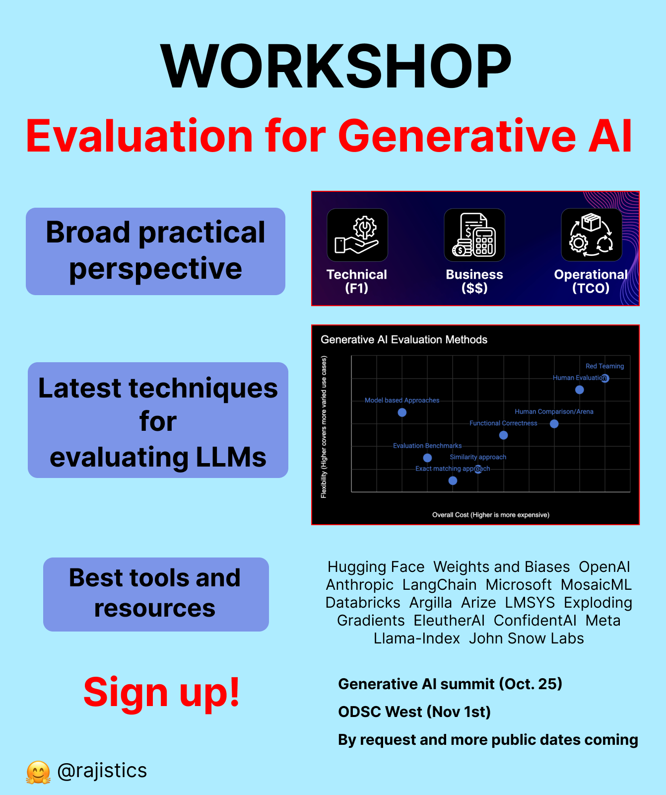

# Resources for Evaluation of LLMs / Generative AI / RAG
This repository includes the slides and some of the notebooks that are used in my Evaluation and RAG workshops. 

Some of the notebooks do require an OpenAI API key.

These notebooks are intended for explaining key points of the talk, please don't try to bring them to production use. If you want to dig deeper or have issues, go to the source for each of these projects.
y
**Updated with my October 2025 Evaluation workshop**

## About the workshop

## Conference Presentations
Generative AI Summit, Austin (Oct 2023) - [Slides](presentation_slides/EvaluatingLLMs_GenAI_Oct2023_Shah.pdf)

ODSC West, San Francisco (Nov 2023) - [Slides](presentation_slides/EvaluatingLLMs_ODSC_Nov2023_Shah.pdf)

Arize Holiday Conference (Dec 2023) - [Slides](presentation_slides/EvaluatingLLMs_Arize_December2023.pdf)  

Data Innovation Conference (Apr 2024) - [Slides](presentation_slides/DataInnovation_Apr_2024.pdf)

ODSC East, Boston (May 2025) - [Slides](presentation_slides/Evaluation_ODSC_May_2025.pdf)

MLOps Generative AI Summit, Austin (Oct 2025) - [References](presentation_slides/links_RAG_Oct2025.md) and 
[Slides](presentation_slides/RAG_Oct2025.pdf) and [Video](https://youtu.be/AS_HlJbJjH8)

ODSC West, Virtual (Oct 2025) - [References](presentation_slides/references_Evaluation_ODSC_Oct2025.md) and 
[Slides](presentation_slides/Evaluation_ODSC_Oct_2025.pdf)

## Notebook links

Testing Properties of a System: [Guidance AI](https://github.com/guidance-ai/guidance/blob/main/notebooks/testing_lms.ipynb)

Langtest tutorials from John Snow Labs: [Colab Notebooks](http://langtest.org/docs/pages/tutorials/tutorials)

LLM Evaluation Harness from EleutherAI: [Github](LLM_evaluation_harness_for_Arc_Easy_and_SST.ipynb) or [Colab notebook](https://colab.research.google.com/drive/1lPHO8wosT72jkhfBbcESsSD56IvpYk9u#scrollTo=asj6HXacKfc_)

Ragas showing Model as an evaluator: [Github](ragas_quickstart.ipynb) or [Colab notebook](https://colab.research.google.com/drive/1i78-peTBdhK5y4ZskFzC_NtLRaqvySXM)

Ragas using LangFuse: [Colab notebook](https://colab.research.google.com/github/langfuse/langfuse-docs/blob/main/cookbook/evaluation_of_rag_with_ragas.ipynb)

Evaluate LLMs and RAG a practical example using Langchain and Hugging Face: [Github](https://github.com/philschmid/evaluate-llms/blob/main/notebooks/01-getting-started.ipynb)

MLFlow Automated Evaluation: [Blog](https://www.databricks.com/blog/announcing-mlflow-28-llm-judge-metrics-and-best-practices-llm-evaluation-rag-applications-part)

LLM Grader on AWS: [Video](https://youtu.be/HUuO9eJbOTk?si=9tI6Na10QhMFkKHe) and [Notebook](https://github.com/fhuthmacher/LLMevaluation/blob/main/LLMInformationExtraction.ipynb)

LLM AutoEval for RunPod by Maxime Labonne [Colab](https://colab.research.google.com/drive/1Igs3WZuXAIv9X0vwqiE90QlEPys8e8Oa)

Agno and Langfuse with a Research Agent: [Github](ResearchAgent_Agno_LangFuse.ipynb)

Building resilient prompts using an evaluation flywheel [Open AI](
https://cookbook.openai.com/examples/evaluation/building_resilient_prompts_using_an_evaluation_flywheel)

## Videos
Evaluation for Large Language Models and Generative AI - A Deep Dive - [YouTube](https://youtu.be/iQl03pQlYWY)

Constructing an Evaluation Approach for Generative AI Models - [YouTube](https://youtu.be/PtXOQDHPddE?si=PQ4N1B2mX2d_9PwC&t=147)

Large Language Models (LLMs) Can Explain Their Predictions - [YouTube](https://youtu.be/9RFz3cQ9NqE?si=IvhEgOFZugQTr5Ku) & [Slides](presentation_slides/ExplanationsLLMs_Jan2024.pdf)

Practical Lessons in Building Generative AI: RAG and Text to SQL - [YouTube](https://www.youtube.com/watch?v=OyY4uxUShys)

Unit Testing for Natural Language (LLMs) + LMUnit model - [YouTube](https://www.youtube.com/watch?v=5KRUvmO7LyQ)

## Other Additional Resources
Josh Tobin's Evaluation talk [YouTube](https://youtu.be/r-HUnht-Gns?si=5vU3RzXf7Jkprwn1)

[Awesome-LLMOps](https://github.com/tensorchord/Awesome-LLMOps?tab=readme-ov-file#llmops)

LLM Evaluation [Tooling Review](https://www.atla-ai.com/post/llm-evaluation-tooling-review)

[Your AI Product Needs Evals](https://hamel.dev/blog/posts/evals/)